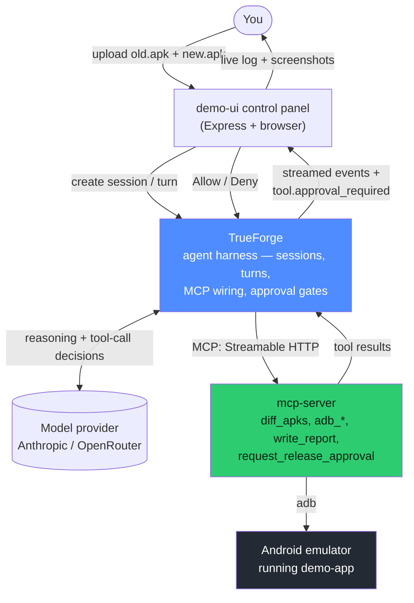
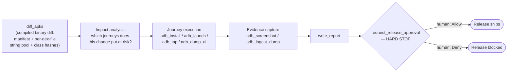
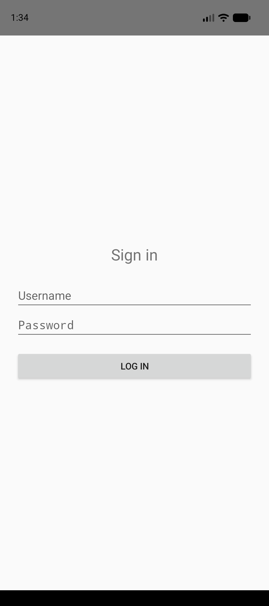

# Autonomous Android Release Agent

Give it `old.apk` and `new.apk`. It diffs the **compiled binaries** (not source/PR diffs),
reasons about which user journeys could be affected, drives a real Android emulator to test
them, and stops for a human approval before signing off on release.

Built for the [TrueFoundry × Polaris "Agents That Act" hackathon](https://www.truefoundry.com/truefoundry-hackathon)
(#agentsthatact), community submission track.

## Why

Existing tools (Firebase Test Lab's Robo test, most 2025/2026 AI QA agents) either crawl the UI
with no notion of what changed, or read a **source/PR diff** to decide what to test. Both miss
the case that matters most for release safety: what actually shipped in the binary can diverge
from the source diff (build flags, resource configs, R8/ProGuard, multi-module merges) — and
source-diff tools don't work at all if you don't have the source (QA/release engineering
verifying a build handed to them, or auditing a third-party APK).

This agent starts from the two compiled APKs instead. The hard bet isn't "drive an emulator"
(commodity at this point) — it's turning a binary diff into a targeted test plan.

## Architecture



The **approval gate** is not something we bolted on: `request_release_approval` is registered
in TrueForge's `require_approval_for_tools`, so the harness itself pauses the turn and waits for
an explicit human `allow`/`deny` before the agent can conclude. That's the safety checkpoint the
hackathon's rubric asks for, enforced by the harness, not by agent-side promise-keeping.

### Agent method



## Repo layout

- `demo-app/` — a minimal Android app (Kotlin, plain Views) used as the demo target. Two
  commits: a baseline build, then a one-file regression (`AuthManager.kt` renames its
  SharedPreferences file/keys), which causes existing users to be silently logged out after an
  in-place app upgrade. This is the bug the agent is supposed to catch without being told where
  it is.
- `mcp-server/` — the actual tools the agent calls: `diff_apks` (manifest + per-dex-file
  string-pool/class-hash diff between two APKs), `adb_install`/`adb_force_stop`/`adb_launch`/
  `adb_tap`/`adb_dump_ui`/`adb_screenshot`/`adb_logcat_*`, `write_report`,
  `request_release_approval`. Exposed over MCP Streamable HTTP.
  Includes `run-manual-demo.mjs`, which calls the same tools directly (no LLM in the loop) to
  produce `evidence/REPORT.md` — used while a model-provider key was still being funded.
- `demo-ui/` — the control-panel web app: drop in the two APKs, watch the agent's reasoning and
  tool calls stream live, click Allow/Deny on the approval prompt.
- `scripts/setup-trueforge.mjs` — idempotent script that registers the MCP server, a model
  provider, and the agent with a running TrueForge instance.
- `agent-instructions.txt` — the agent's system prompt / method.
- `artifacts/` — prebuilt `old.apk` and `new.apk` so you can run the demo without building the
  Android app yourself.

## Prerequisites

- Node.js **22+** (TrueForge's native deps require it; everything else here also runs fine on 22)
- Android SDK with an emulator + at least one AVD (Android Studio's default install location,
  `~/Android/Sdk`, is auto-detected by `adb`/`emulator`)
- An API key for a tool-calling-capable model: Anthropic, or any OpenAI-compatible gateway
  (OpenRouter, TrueFoundry's AI Gateway, etc.)

## Setup

```bash
# 1. Boot an emulator (use any AVD you have)
$ANDROID_HOME/emulator/emulator -avd <your-avd-name> &

# 2. Start the MCP tools server
cd mcp-server && npm install
node server.mjs &

# 3. Start TrueForge (needs Node 22)
npx --yes @truefoundry/trueforge &
# If your network has broken outbound IPv6 (symptom: "Connect Timeout Error" to a model
# provider that works fine with plain curl), also set:
#   NODE_OPTIONS=--dns-result-order=ipv4first
# If TrueForge and the MCP server are both on localhost, also set:
#   OUTBOUND_URL_ALLOWED_HOSTS='["127.0.0.1","localhost"]'
# (TrueForge blocks loopback/private outbound URLs by default — a real SSRF guard, not a bug.)

# 4. Register the model provider, MCP server, and agent
MODEL_PROVIDER=anthropic API_KEY=sk-ant-... node scripts/setup-trueforge.mjs
# or, via OpenRouter:
MODEL_PROVIDER=openrouter API_KEY=sk-or-... MODEL_ID=anthropic/claude-haiku-4.5 node scripts/setup-trueforge.mjs

# 5. Start the control panel
cd demo-ui && npm install
node server.mjs &
```

Open `http://localhost:8792`, drop in `artifacts/old.apk` and `artifacts/new.apk` (or your own
two builds of the same app), click **Run Release Agent**, and approve or deny the release when
prompted.

## Sample run (real evidence, from before the LLM key was funded)

**[Full report: `evidence/REPORT.md`](evidence/REPORT.md)** — a complete run of the tool
pipeline (`diff_apks` → install old.apk → login → force-stop → install new.apk `-r` → relaunch)
against the real emulator, with real screenshots and logcat. This particular run was driven by
`scripts/run-manual-demo.mjs` (deterministic, calling the exact same MCP tools) rather than the
live LLM agent loop, while a working model-provider key was still being sorted — labeled as such
in the report itself. Verdict: `REGRESSION_DETECTED`, correctly.

| Logged in (old.apk) | Bounced to login after upgrading to new.apk |
|---|---|
|  |  |

## Rebuilding the demo app yourself

```bash
cd demo-app
gradle assembleDebug            # builds v1.0 (baseline) — see git log for the injected bug commit
```

The two commits in `demo-app/` show the whole regression: `git log -p -- app/src/main/java`.

## AI-assistant disclosure

Built with [Claude Code](https://claude.com/claude-code) (Anthropic) as a pair-programming
assistant for the full session: architecture decisions, the Android demo app, the MCP tools
server, the TrueForge integration (including discovering and working around two real issues —
TrueForge's outbound SSRF guard blocking loopback URLs, and a broken-IPv6 environment causing
silent connect timeouts to model providers), and the control-panel UI.

## Known limitations

- `diff_apks` diffs the manifest plus, per dex file, string pools and a per-class content hash —
  it correctly handles multidex (an early bug in this project diffed only `classes.dex` and
  silently missed app code that D8 had placed in `classes3.dex`; fixed by diffing every
  `classes*.dex` present in either build). It still isn't a full bytecode decompiler: it tells you
  *which* class changed and what string constants moved, not a semantic method-level diff. Good
  enough to drive journey selection; a production version would want a proper dex differ (e.g.
  `diffuse`) or ProGuard mapping-file-aware diffing for obfuscated release builds.
- The demo app's "journeys" are simple by design (login, upgrade-preserves-session) so the demo
  is legible on camera. The agent isn't limited to a fixed journey catalog — it reasons about
  what to test from the diff — but it's only ever been exercised against this one app.
