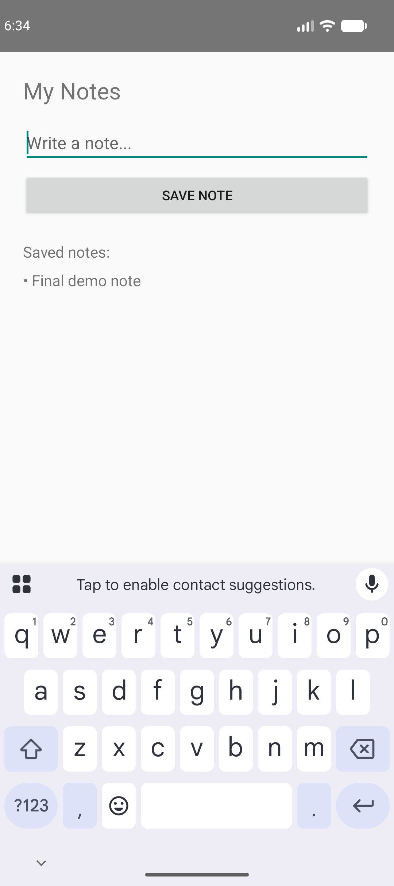

# Release Regression Report — Recorded demo run (notes app)

## 🔴 REGRESSION_DETECTED

**Build under test:** `com.example.notesdemo` — old.apk (v1.0, currently shipped) vs new.apk (v2.0, release candidate)
**Method:** compiled-binary diff → impact analysis → live emulator execution → evidence capture → verdict

> Driven live against the real MCP tool server and a live Android emulator, narrated and
> captured through this project's own control-panel UI (see `mcp-server/live.mjs`) — same
> diffing/execution/evidence/approval-gate pipeline as the auth-app report, different app and
> bug entirely, showing the agent reasons from each diff rather than recognizing one specific
> bug shape.

## What changed

<details>
<summary>Full diff_apks output</summary>

## APK diff (compiled binary, not source)
classes.dex: 2336108 -> 2336108 bytes (delta 0) [identical size]
classes2.dex: 1632 -> 1632 bytes (delta 0) [identical size]
classes3.dex: 6940 -> 6036 bytes (delta -904)

### AndroidManifest.xml diff
```
--- /tmp/apkdiff-7QVHU3/old_manifest.txt	2026-09-27 18:21:57.080298778 +0530
+++ /tmp/apkdiff-7QVHU3/new_manifest.txt	2026-09-27 18:21:57.080298778 +0530
@@ -1,7 +1,7 @@
 N: android=http://schemas.android.com/apk/res/android
   E: manifest (line=2)
-    A: android:versionCode(0x0101021b)=(type 0x10)0x1
-    A: android:versionName(0x0101021c)="1.0" (Raw: "1.0")
+    A: android:versionCode(0x0101021b)=(type 0x10)0x2
+    A: android:versionName(0x0101021c)="2.0" (Raw: "2.0")
     A: android:compileSdkVersion(0x01010572)=(type 0x10)0x22
     A: android:compileSdkVersionCodename(0x01010573)="14" (Raw: "14")
     A: package="com.example.notesdemo" (Raw: "com.example.notesdemo")

```

### classes.dex string-pool diff (reveals changed string literals — e.g. SharedPreferences keys/file names, constants)
```
--- classes3.dex string-pool diff ---
--- /tmp/apkdiff-7QVHU3/classes3.dex.old.strings	2026-09-27 18:21:57.244296989 +0530
+++ /tmp/apkdiff-7QVHU3/classes3.dex.new.strings	2026-09-27 18:21:57.244296989 +0530
@@ -1,58 +1,39 @@
- $i$a$-filter-NotesStore$getAll$1
 ,$i$a$-ifBlank-MainActivity$onCreate$1$text$1
-$i$f$filter
-$i$f$filterTo
 $input
 $Lcom/example/notesdemo/MainActivity;
 $notesList
 &$r8$lambda$QV44Vm_QRsrdNWkUoiaDYvp6zBM
 &$r8$lambda$-Z8qhxS_UIT5_rRkMoZl9PgSDTI
 $store
-$this$filter$iv
-$this$filterTo$iv$iv
-10#1:19
-10#1:20,2
-1#1,18:1
 1#1,34:1
 1#2:35
 + 1 MainActivity.kt
-+ 1 NotesStore.kt
-+ 2 _Collections.kt
 + 2 fake.kt
-774#2:19
-865#2,2:20
 activity_main
-	all_notes
 	app_debug
 append
 apply
-Bn0 
 checkNotNullParameter
 clear
 com/example/notesdemo/MainActivity
-com/example/notesdemo/NotesStore
 context
+count
 currentTimeMillis
 D8$$SyntheticClass
-destination$iv$iv
 e~~D8{"backend":"dex","compilation-mode":"debug","has-checksums":true,"min-api":24,"version":"8.7.18"}
 edit
-element$iv$iv
 findViewById
 getAll
 getSharedPreferences
 	getString
 getText
-hasNext
 <init>
 input
 invoke
 isBlank
 isEmpty
-iterator
 joinToString$default
 Kotlin
-kotlin/collections/CollectionsKt___CollectionsKt
 kotlin/jvm/internal/FakeKt
 kotlin.jvm.PlatformType
 Landroid/app/Activity;
@@ -68,24 +49,20 @@
 Landroid/widget/EditText;
 Landroid/widget/TextView;
 >Lcom/example/notesdemo/MainActivity$$ExternalSyntheticLambda0;
-~~~{"Lcom/example/notesdemo/MainActivity$$ExternalSyntheticLambda0;":"3c93e3396","Lcom/example/notesdemo/MainActivity$$ExternalSyntheticLambda1;":"-363c96c85","Lcom/example/notesdemo/MainActivity;":"a0922ae5","Lcom/example/notesdemo/NotesStore;":"8961cecd"}
+~~~{"Lcom/example/notesdemo/MainActivity$$ExternalSyntheticLambda0;":"3c93e3396","Lcom/example/notesdemo/MainActivity$$ExternalSyntheticLambda1;":"-363c96c85","Lcom/example/notesdemo/MainActivity;":"a0922ae5","Lcom/example/notesdemo/NotesStore;":"f3062d96"}
 >Lcom/example/notesdemo/MainActivity$$ExternalSyntheticLambda1;
 "Lcom/example/notesdemo/NotesStore;
 Lcom/example/notesdemo/R$id;
  Lcom/example/notesdemo/R$layout;
 Ldalvik/annotation/Signature;
 (Ldalvik/annotation/SourceDebugExtension;
-length
 Ljava/lang/CharSequence;
 Ljava/lang/Iterable;
 Ljava/lang/Object;
-[Ljava/lang/String;
 Ljava/lang/String;
 Ljava/lang/StringBuilder;
 Ljava/lang/System;
 Ljava/util/ArrayList;
-Ljava/util/Collection;
-Ljava/util/Iterator;
 Ljava/util/List;
 Ljava/util/List<
 "Lkotlin/collections/CollectionsKt;
@@ -94,23 +71,22 @@
 Lkotlin/Metadata;
 Lkotlin/text/StringsKt;
 LLLLLILLIL
-LLLZIIL
 MainActivity.kt
-next
+mpEhp,`
 No notes yet.
 note
+note_
 Note 
 	noteInput
 notes
+notes_data
 	notesList
-notes_store
 NotesStore.kt
 onClick
 onCreate
 onCreate$lambda$2
 onCreate$refresh
 onCreate$refresh$lambda$0
-plus
 prefs
 	putString
 saveButton
@@ -118,14 +94,12 @@
 setContentView
 setOnClickListener
 setText
+size
 *S Kotlin
-*S KotlinDebug
 SMAP
-split$default
 store
 text
 toString
-updated
 value
 VLLL
 VLLLL

```


</details>

**In plain English:** only `NotesStore` changed, isolated by content hash. `MainActivity`
untouched. The string pool shows `notes_store`/`all_notes` disappearing and `notes_data`/`note_`
appearing — a SharedPreferences file/key rename in the class that owns saved notes.

## Journeys tested

| # | Journey | Expected | Actual | Result |
|---|---|---|---|---|
| J1 | Save a note on old.apk | Note listed | "Final demo note" listed | ✅ PASS |
| J2 | Upgrade to new.apk → reopen | Same note still listed | "No notes yet." | 🔴 **FAIL** |

<table><tr>
<td align="center"><br><sub>Note saved on old.apk</sub></td>
<td align="center"><br><sub>Same install, after upgrading to new.apk</sub></td>
</tr></table>

## Root cause

`NotesStore` switched from a single delimited-string value under `notes_store`/`all_notes` to
indexed keys (`note_0`, `note_1`, ...) under a renamed file `notes_data`, with no migration. The
note saved in J1 is still physically on the device — in the old file, under the old key — but the
new code only ever looks in the new file, so it reads nothing and shows "No notes yet." No crash
logged (see `final_after_upgrade.logcat.txt`).

This is the same *class* of bug as the auth-app scenario (a SharedPreferences file/key rename
with no migration on upgrade) hitting a completely different feature — the mechanism repeats,
the surface area doesn't.

## Suggested fix

```kotlin
class NotesStore(context: Context) {
    private val prefs = context.getSharedPreferences("notes_data", Context.MODE_PRIVATE)

    init {
        if (prefs.getString("note_0", null) == null) migrateFromV1(context)
    }

    private fun migrateFromV1(context: Context) {
        val legacy = context.getSharedPreferences("notes_store", Context.MODE_PRIVATE)
        val old = legacy.getString("all_notes", null) ?: return
        old.split("\u0001").filter { it.isNotEmpty() }
            .forEachIndexed { i, note -> prefs.edit().putString("note_$i", note).apply() }
    }
}
```

**Longer-term:** don't hand-roll a storage format for user data — use Room (SQLite) or
DataStore, both of which have first-class schema-migration support.

## Verdict

**REGRESSION_DETECTED** — do not ship without the migration above.
